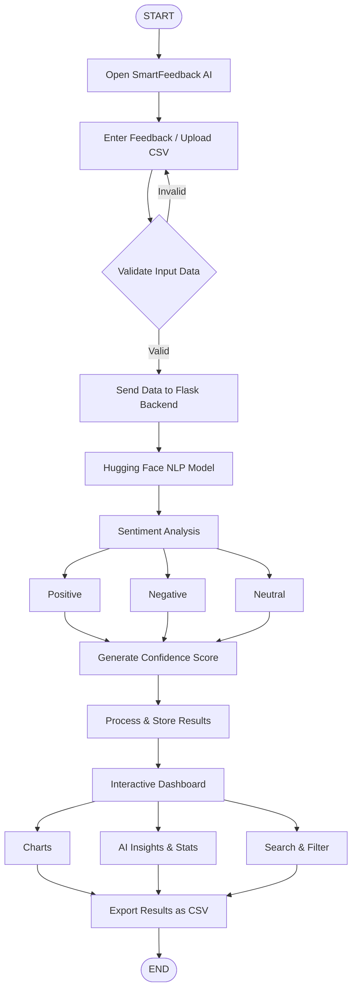

🤖 SmartFeedback AI – Sentiment Analysis Tool

Turn Feedback into Actionable Insights

A full-stack AI-powered web application that automatically analyzes student, customer, and employee feedback using a real NLP sentiment analysis model. The system classifies feedback as Positive, Negative, or Neutral and provides an interactive analytics dashboard with charts, insights, and export features.

📌 Problem Statement

Colleges, institutions, and small businesses collect a large amount of written feedback from students, customers, and employees. Manually the reading and analyzing every response is time-consuming and often causes important negative feedback to be overlooked.

The objective is to build a web-based application that automatically analyzes multiple feedback entries, classifies sentiments as Positive, Negative, or Neutral, highlights critical feedback, and presents meaningful insights through an interactive dashboard.

💡 Proposed Solution

SmartFeedback AI is a full-stack AI application that uses a Hugging Face Transformer model to perform real-time sentiment analysis.

The application allows users to:

Enter multiple feedback entries manually.

Upload CSV files for bulk analysis.

Analyze sentiments using AI.

View an interactive dashboard with charts.

Highlight important negative feedback.

Generate AI-powered insights.

Export analyzed results as CSV.

This solution helps institutions and organizations quickly understand user opinions and make data-driven decisions.

✨ Features

AI-Based Sentiment Analysis

Manual Multiple Feedback Input

Bulk CSV Upload

Interactive Dashboard

Dynamic Pie & Bar Charts

Confidence Score for Every Feedback

Needs Attention Section

Positive Highlights

AI Insights

Common Topics Detection

CSV Export

Responsive Design

Light & Dark Mode

🛠 Technology Stack

Category

	

Technology

Frontend

	

React.js, Vite

Styling

	

Tailwind CSS

Charts

	

Recharts

Icons

	

Lucide React

Backend

	

Python, Flask

API

	

Flask-CORS

AI/NLP

	

Hugging Face Transformers

Data Processing

	

Pandas

Storage

	

SQLite (Optional)

System Architecture

## 🔄 SYSTEM FLOWCHART

👨‍💻 Team Members

Name

	

Register Number

Divya V

	

73152413049

Dharanipriya S

	

73152413043

Bharanidharan R

	

73152413024
