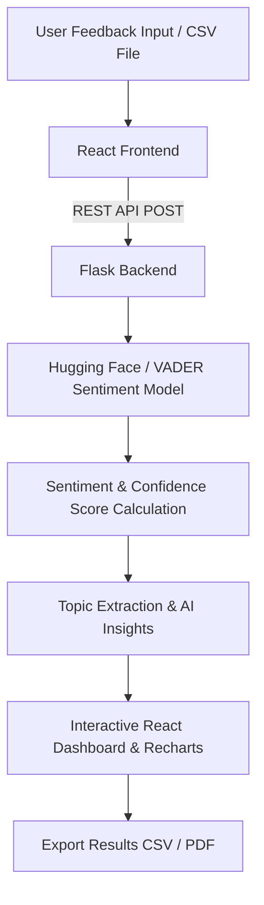

# 🤖 SmartFeedback AI – Sentiment Analysis Tool

> **Turn Feedback into Actionable Insights**

A full-stack AI-powered web application that automatically analyzes student, customer, and employee feedback using a real NLP sentiment analysis model. The system classifies feedback as **Positive**, **Negative**, or **Neutral** and provides an interactive analytics dashboard with charts, insights, and export features.

---

## 📌 Problem Statement

Colleges, institutions, and small businesses collect a large amount of written feedback from students, customers, and employees. Manually reading and analyzing every response is time-consuming and often causes important negative feedback to be overlooked.

The objective is to build a web-based application that automatically analyzes multiple feedback entries, classifies sentiments as **Positive**, **Negative**, or **Neutral**, highlights critical feedback, and presents meaningful insights through an interactive dashboard.

---

## 💡 Proposed Solution

**SmartFeedback AI** is a full-stack AI application that uses a Hugging Face Transformer model (with VADER fallback) to perform real-time sentiment analysis.

The application allows users to:
- Enter multiple feedback entries manually.
- Upload CSV files for bulk analysis.
- Analyze sentiments using AI.
- View an interactive dashboard with dynamic charts.
- Highlight important negative feedback.
- Generate AI-powered insights & common topics.
- Export analyzed results as CSV and PDF reports.

This solution helps institutions and organizations quickly understand user opinions and make data-driven decisions.

---

## ✨ Features

- 🧠 **AI-Based Sentiment Analysis**: Pre-trained Hugging Face Transformer / VADER model with confidence scoring for every response.
- ✍️ **Manual Multiple Feedback Input**: Dynamic multi-row text input interface.
- 📁 **Bulk CSV Upload**: Drag-and-drop file uploader with validation, row count detection, and sample file download.
- 📊 **Interactive Dashboard**: Summary metric cards for Total, Positive %, Negative %, Neutral %, Dominant Sentiment, and Average Confidence.
- 📈 **Dynamic Charts**: Recharts Doughnut chart (distribution) and Bar chart (sentiment counts).
- 🚨 **Needs Attention Section**: Isolates negative feedback and low-confidence predictions with high-risk warning alerts.
- ⭐ **Positive Highlights**: Dedicated section showcasing top positive feedback.
- 💡 **AI Insights & Common Topics**: Dynamic textual summary generation and interactive topic keyword filtering.
- 📥 **CSV & PDF Export**: Export analyzed results to formatted CSV and download executive PDF reports.
- 🌓 **Responsive Design & Dark/Light Mode**: Styled with Tailwind CSS for modern enterprise aesthetics.

---

## 🛠 Technology Stack

| Category | Technology |
| :--- | :--- |
| **Frontend** | React.js, Vite |
| **Styling** | Tailwind CSS |
| **Charts** | Recharts |
| **Icons** | Lucide React |
| **Backend** | Python, Flask |
| **API** | Flask-CORS |
| **AI / NLP** | Hugging Face Transformers, VADER |
| **Data Processing** | Pandas |
| **File Formats** | CSV, JSON, PDF |

---

## 📂 Project Structure

```
smartfeedback-ai/
│
├── frontend/
│   ├── src/
│   │   ├── components/     # Navbar, Hero, Input, CSVUpload, Dashboard, Charts, Table, Insights, Export
│   │   ├── services/       # API integration layer (api.js)
│   │   ├── App.jsx         # Main application container
│   │   └── main.jsx        # React entry point
│   ├── package.json
│   └── vite.config.js
│
├── backend/
│   ├── app.py              # Flask API endpoints (/api/health, /api/analyze, /api/analyze-csv, /api/export-pdf)
│   ├── sentiment.py        # Sentiment analysis engine (HuggingFace + VADER fallback + Topics)
│   ├── requirements.txt
│   └── sample_feedback.csv # Sample dataset (25 entries)
│
├── README.md
└── .gitignore
```

---

## 🔄 System Architecture & Application Workflow



1. User enters feedback manually or uploads a CSV file.
2. React frontend sends the data to the Flask backend API.
3. Flask processes the feedback using a Hugging Face / VADER sentiment model.
4. Each feedback receives a sentiment label (`Positive`, `Negative`, `Neutral`) and confidence score (0-100%).
5. Results are displayed in an interactive dashboard with charts, alerts, and insights.
6. Users can export analyzed results as CSV or PDF report.

---

## 🚀 Installation & Setup

### 1. Backend Setup
```bash
cd backend

# Create virtual environment
python -m venv venv

# Windows Activation:
venv\Scripts\activate

# Install dependencies
pip install -r requirements.txt

# Run Flask backend
python app.py
```
*Backend runs at: `http://127.0.0.1:5000`*

### 2. Frontend Setup
```bash
cd frontend

# Install dependencies
npm install

# Run Vite dev server
npm run dev
```
*Frontend runs at: `http://localhost:5173`*

---

## 📤 Sample CSV Format

Example `sample_feedback.csv`:
```csv
feedback
"The food quality was excellent."
"The service was very poor."
"The classroom was okay."
"Staff were friendly and helpful."
```

---

## 🔌 API Endpoints

| Method | Endpoint | Purpose |
| :--- | :--- | :--- |
| `GET` | `/api/health` | Backend status & NLP model check |
| `POST` | `/api/analyze` | Analyze manual feedback list |
| `POST` | `/api/analyze-csv` | Analyze uploaded CSV file |
| `POST` | `/api/export-pdf` | Generate downloadable PDF summary report |

---

## 📊 Example Output

| Feedback | Sentiment | Confidence |
| :--- | :--- | :--- |
| The food was excellent | **Positive** | 96% |
| Service was terrible | **Negative** | 94% |
| The experience was okay | **Neutral** | 72% |

---

## 🎯 Future Enhancements

- PDF Report Generation (Implemented!)
- Multi-language Sentiment Analysis
- User Authentication
- Cloud Deployment
- Feedback Trend Analysis
- Advanced Admin Dashboard

---

## 👨‍💻 Team Members

| Name | Register Number |
| :--- | :--- |
| **Divya V** | 73152413049 |
| **Dharanipriya S** | 73152413043 |
| **Bharanidharan R** | 73152413024 |
